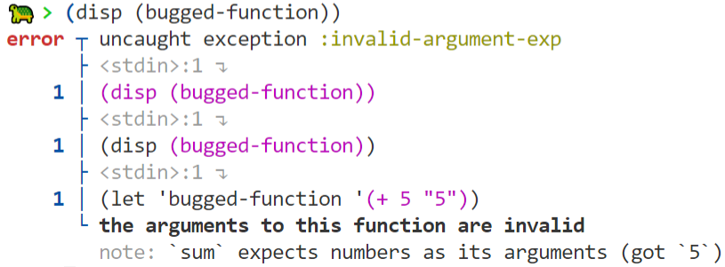

# The Turtle Programming Language

Turtle is a humble, fun, and friendly Lisp. I built it as an exercise, and it's not meant to be taken seriously. Still, you can [install it](#install) using Cargo, or browse some [example code](#examples).

```lisp
;; Print "Hello, world!" to the terminal:
(disp "Hello, world!")

;; Let's print the squares of the numbers 1 through 10 using Turtle.
(func square (n) (exp n 2))
(disp (map square (range 10)))

;; We can also do this using anonymous functions (lambdas):
(disp (map (lambda '(n) '(exp n 2)) (range 10)))
```

## Motivation

There are a lot of programming languages out there, and most aren't suitable for any real-world use—they are _toy programming languages_. Turtle is no exception: it exists because I wanted to experiment with Lisp without having to deal with the nuances of the most popular implementations (Common Lisp, Clojure, Scheme, etc).

Turtle has no IO facilities, and it's not particularly fast. However, it's ruthlessly simple, memory efficient, thread safe (well, at least it will be once I implement a way to spawn threads), and is great for self-contained programming and math challenges (like Project Euler). Turtle is suitable for both functional and imperative programming, and—like any good Lisp—has strong macro and metaprogramming support.

Turtle is inspired by Haskell, Rust, Scheme, Common Lisp, Python, and Ruby. The interpreter is written in Rust, but most of the language's features are written in Turtle itself.

## Install

You can install Turtle using [Cargo](crates.io) by running `cargo install turtle-lang`.

## Examples

##### Hello World

```lisp
(disp "Hello, world!")
```

##### Error

Having helpful error messages is a priority for Turtle. Here's an example type mismatch error stacktrace:



##### Fizz Buzz (Crackle Pop)

FizzBuzz is a simple program that counts to 100, but prints "Fizz" if a number is divisible by 3, "Buzz" if a number is divisible by 5, and "FizzBuzz" if a number is divisible by both 3 and 5.

First, let's define a function that handles a single number:

```lisp
(func handle (n)
    (cond ((eq (modulo n 15) 0) (disp "FizzBuzz"))
          ((eq (modulo n 3) 0) (disp "Fizz"))
          ((eq (modulo n 5) 0) (disp "Buzz"))
          ('t (disp n))))
```

Now, here's an imperative approach to counting: 

```lisp
(let 'i 0)
(while
    (decreasing 100 i)
    (do
        (handle i)
        (++ i)))
```

Here's a more functional approach:

```lisp
(map handle (range 100))
```

##### Prime Factorization

The [standard library](src/stdlib) has a built-in function that finds the prime factorization of any integer. Here's its imperative definition:

```lisp
(func prime-factorization 
    (n) 
    (do 
        (letq factors ()) 
        (letq curr n) 
        (while 
            (not (eq ,(append '(prod) factors) n))
            (do
                (let 'trying 2)
                (while
                    (not (eq (modulo curr trying) 0))
                    (++ trying))
                (push! factors trying)
                (let 'curr (/ curr trying))))
     factors))
```

Here's how you might go about using this definition in your own code (in this example, to solve Project Euler [problem 3](https://projecteuler.net/problem=3)):

```lisp
;; From https://projecteuler.net/problem=3
;;
;; The prime factors of 13195 are 5, 7, 13 and 29.
;;
;; What is the largest prime factor of the number 600851475143 ?

(import "@math" :math)

(let 'n 600851475143)

(assert (eq (last (math::prime-factorization n)) 6857))
```

## File Types

I typically use the `.lisp` file extension for Turtle source code for better editor support, but in the long term I'd like to see `.tl` used as well.
